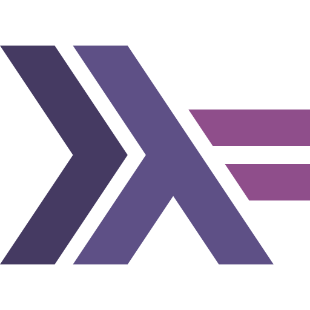
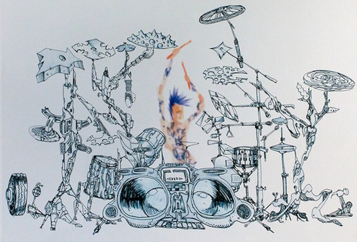
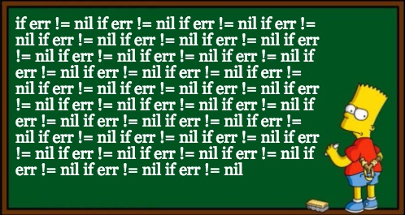
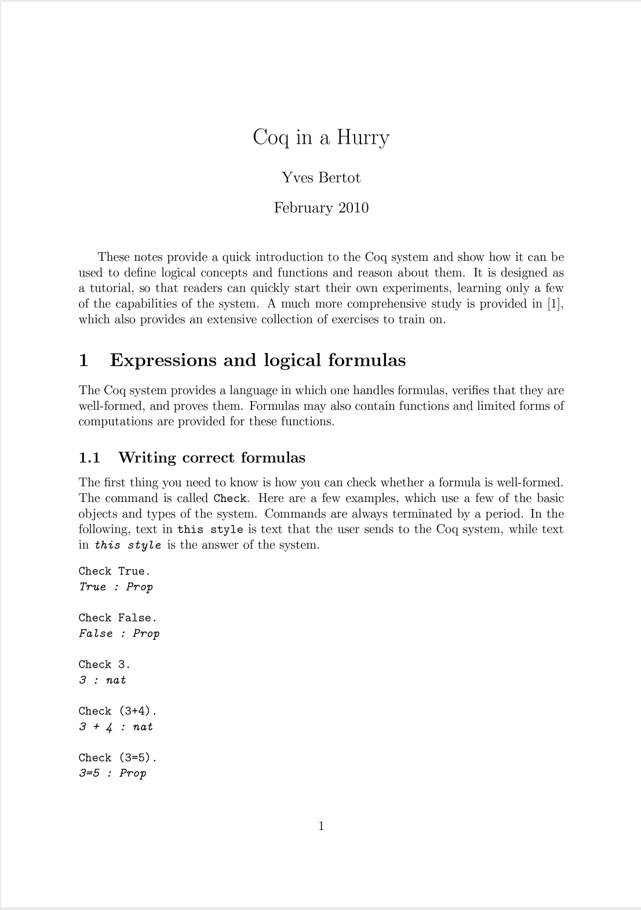
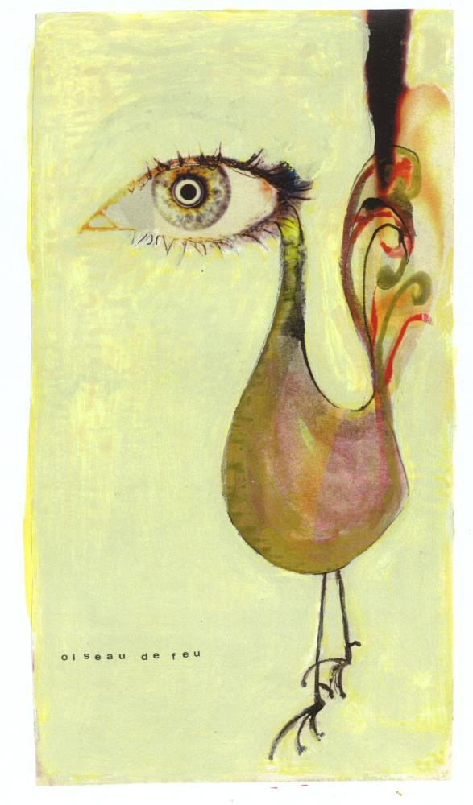
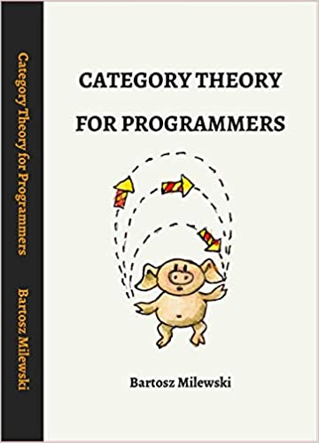
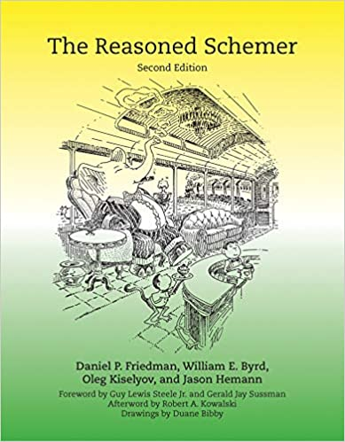

  
  
  
  
  
  

<h1 align="center">Projects</h1>

<h2 align="center">Katydid: validation language for serialized data</h2>

  
  
  
  

<h2 align="center">gogoprotobuf, erlfmt, goderive, gographviz, music generation</h2>

  
  
  
  
  
  

<h1 align="center">Videos</h1>

  
  
  

<h1 align="center">
  
  Blog
</h1>

  
  
  

<h1 align="center">Music</h1>

  
  
  
  
  
  
  
  

<h1 align="center">Learnings</h1>

  
  
  
  
  
  <a href="https://github.com/awalterschulze/learning">more...</a>

